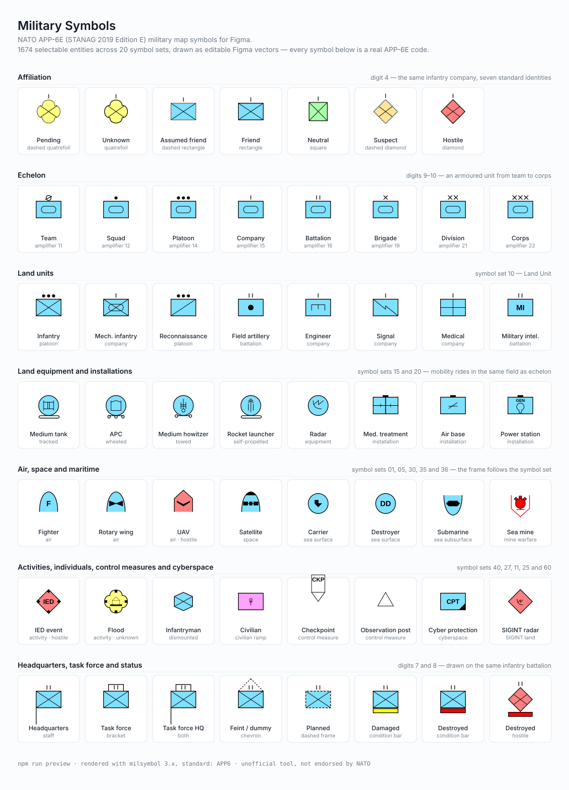

# Military Symbols

A Figma plugin that draws **NATO APP-6E (STANAG 2019 Edition E)** military map symbols as
real, editable vector layers — not images. Pick an entity, set the affiliation and echelon,
insert. The 30-character SIDC is stored on every layer, so any symbol you insert can be reopened,
restyled or re-affiliated later without rebuilding it.

Everything runs locally. The plugin makes no network requests: the renderer and the full
APP-6E catalogue are bundled into the plugin itself.



## Features

- **1 674 selectable entities** across the 20 APP-6E symbol sets (land, air, space, sea,
  subsurface, mine warfare, control measures, activities, SIGINT, cyberspace), plus 2 835
  sector modifiers, all searchable by name. The catalogue holds 1 721 entity codes in total;
  the 47 the standard has withdrawn are kept so that old SIDCs still decode, marked
  `{Disused}`, and hidden from search. The same is true of 202 of the 2 835 sector modifiers.
- **231 built-in presets** — a curated shelf of ready-made symbols in 12 categories, on the
  Build tab under *Start from a preset*. Every one is verified in CI to draw a real icon.
- **Build tab** — live preview, every SIDC field as a labelled control, and the raw SIDC
  editable by hand.
- **Browse tab** — a thumbnail sheet of a whole symbol set; multi-select and insert.
- **Batch tab** — paste a list of SIDCs, or expand one symbol into an affiliation series,
  an echelon ladder, a status series or a whole symbol-set sheet.
- **ORBAT tab** — type an indented outline and get a laid-out order of battle: one symbol per
  unit, echelons and affiliations inherited down the tree, connectors drawn between them.
- **Canvas tab** — re-open, restyle or change the affiliation of symbols already inserted,
  in place.
- **Component sets** — one click produces a component set with a variant per affiliation.
- **Text amplifiers** — 27 amplifier fields, inserted as genuine Figma text layers (or
  flattened to outlines if you would rather not depend on a font).
- Grid, row, stacked or into-the-selected-frame layout, optional captions, optional wrapper
  frame, exact target height in pixels, and seven colour modes including monochrome.

## Look and feel

The panel is styled in the Nofolios house language: Inter, the `#5A4EFF` brand indigo with
the `#EEA0FF` accent, pill chips and tabs, gradient primary actions, and the 4px brand rule
across the top of the panel. Every colour lives as a token in `src/ui/styles.css`.

The panel is **light only**. It does not invert for Figma's dark theme, so it reads as a white
Nofolios surface whichever theme the editor is in.

## Install (local, unpublished plugin)

You need the **Figma desktop app** (development plugins cannot be imported from the browser)
and **Node.js 20 or newer**.

```bash
git clone <this repository>
cd Military-Symbol
npm install
npm run build          # writes dist/code.js and dist/ui.html
```

Then, in the Figma desktop app:

1. **Plugins → Development → Import plugin from manifest…**
2. Choose `manifest.json` at the root of this repository.
3. The plugin appears under **Plugins → Development → Military Symbols**.

Re-run `npm run build` after changing any source file, or leave `npm run watch` running and
just relaunch the plugin.

The plugin runs in **Figma Design only** — `manifest.json` declares
`"editorType": ["figma"]`, because components and variants exist only on that surface.

`npm run package` produces a flat zip under `dist/` for handing the built plugin to someone
else; they import its `manifest.json` the same way.

## Quick start (60 seconds)

1. Run the plugin. The **Build** tab opens on a friendly infantry platoon.
2. Under *Entity*, press **All sets**, then type `tank` in the search box and pick **Tank**
   (Land Equipment). The preview updates immediately and the symbol set follows the entity.
3. Set **Affiliation** to `Hostile / Faker`.
4. Under *Amplifiers*, set **Echelon / mobility** to `Tracked`.
5. Open **Text amplifier fields** and put `T-72` in *V — Type*.
6. Press **Insert symbol**. The symbol lands at the centre of your viewport, selected, with
   its SIDC saved on the layer.

In a hurry, skip steps 2–4: open **Start from a preset** on the Build tab and pick one of the
231 ready-made symbols instead.

Then try **Variants** next to the insert button: the same symbol becomes a component set with
one variant per affiliation.

## Preview sheet

`assets/preview.svg` — shown above — is generated, not hand-drawn:

```bash
npm run preview        # build/make-preview.mjs -> assets/preview.svg
```

It renders through the same milsymbol configuration the plugin uses, and refuses to write the
file if any symbol on it stops drawing a real icon, so it cannot quietly drift away from what
the plugin produces.

## Documentation

| Document | What is in it |
|---|---|
| [docs/USAGE.md](docs/USAGE.md) | Task-by-task guide: build, presets, search, batch, ORBAT, variants, re-edit, style recipes |
| [docs/SIDC.md](docs/SIDC.md) | The 30-character SIDC explained, every enumeration, worked examples |
| [docs/DEVELOPMENT.md](docs/DEVELOPMENT.md) | Build, test, debug, verify and package the plugin |
| [docs/VERIFICATION.md](docs/VERIFICATION.md) | Which claims about the standard were tested, and how |
| [THIRD-PARTY.md](THIRD-PARTY.md) | Bundled dependencies and their licences |

## Standards

- **NATO STANAG 2019 / APP-6E** — *Joint Symbology*, Edition E. This is the symbology the
  plugin emits by default; SIDCs carry the version digits **`14`**.
- **MIL-STD-2525E** — the US equivalent. The two differ for a handful of glyphs; the
  *Standard* setting switches the drawing rules, and version digits `13` identify a
  MIL-STD-2525E SIDC.

The plugin is an unofficial tool. It is not endorsed by NATO or by any defence organisation,
and it is not a substitute for the published standard. Symbols are drawn as accurately as the
underlying renderer allows; check anything that has to be authoritative against APP-6E itself.

## Licence and credits

This plugin is MIT licensed — see [LICENSE](LICENSE).

- Symbology is rendered by **[milsymbol](https://github.com/spatialillusions/milsymbol) 3.x**
  by Måns Beckman — MIT.
- The entity and modifier catalogue is generated at build time from
  **[milstandard-e](https://github.com/spatialillusions/milstandard-e)** — MIT.
- The plugin UI is built with **[Preact](https://preactjs.com)** — MIT.

Full licence texts and copyright lines are in [THIRD-PARTY.md](THIRD-PARTY.md).
